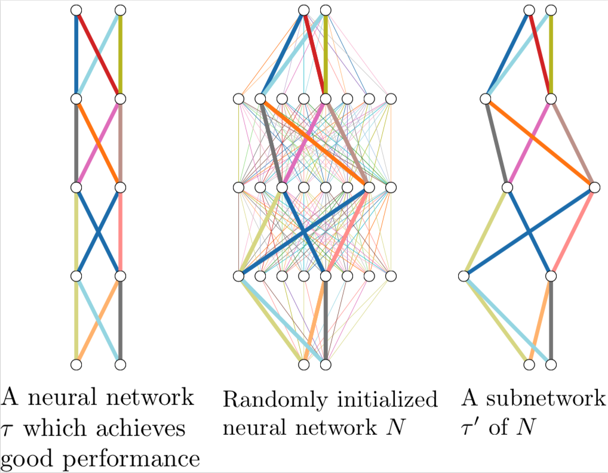

# What's hidden in a randomly weighted neural network?

by Vivek Ramanujan*, Mitchell Wortsman*, Aniruddha Kembhavi, Ali Farhadi, Mohammad Rastegari

arxiv link: https://arxiv.org/abs/1911.13299
<!--  -->

<p align="center">

</p>

## News & Updates

- Simple one file example! Check out `simple_mnist_example.py`.
- Faster version of `GetSubNet` written by [Suchin Gururangan](https://suchin.io/)! Feel free to replace [the old version](https://github.com/allenai/hidden-networks/blob/master/utils/conv_type.py#L14) with this:
```python
def percentile(t, q):
    k = 1 + round(.01 * float(q) * (t.numel() - 1))
    return t.view(-1).kthvalue(k).values.item()
    
class GetSubnetFaster(torch.autograd.Function):
    @staticmethod
    def forward(ctx, scores, zeros, ones, sparsity):
        k_val = percentile(scores, sparsity*100)
        return torch.where(scores < k_val, zeros.to(scores.device), ones.to(scores.device))

    @staticmethod
    def backward(ctx, g):
        return g, None, None, None
```

## Setup

1. Set up a virtualenv with python 3.7.4. You can use pyvenv or conda for this.
2. Run ```pip install -r requirements.txt``` to get requirements
3. Create a data directory as a base for all datasets. For example, if your base directory is ```/mnt/datasets``` then imagenet would be located at ```/mnt/datasets/imagenet``` and CIFAR-10 would be located at ```/mnt/datasets/cifar10```

## Starting an Experiment 

We use config files located in the ```configs/``` folder to organize our experiments. The basic setup for any experiment is:

```bash
python main.py --config <path/to/config> <override-args>
```

Common example ```override-args``` include ```--multigpu=<gpu-ids seperated by commas, no spaces>``` to run on GPUs, and ```--prune-rate``` to set the prune rate, ```weights_remaining``` in our paper, for an experiment. Run ```python main --help``` for more details.

### YAML Name Key

```
(u)uc -> (unscaled) unsigned constant
(u)sc -> (unscaled) signed constant
(u)pt -> (unscaled) pretrained init
(u)kn -> (unscaled) kaiming normal
```

### Example Run

```bash
python main.py --config configs/smallscale/conv4/conv4_usc_unsigned.yml \
               --multigpu 0 \
               --name example \
               --data <path/to/data-dir> \
               --prune-rate 0.5
```

### Expected Results and Pretrained Models

| Model  | Params | % Weights Remaining | Initialization | Accuracy (ImageNet) |
| :-------------: | :-------------: | :-------------: | :-------------: | :-------------: |
| [ResNet-50](https://prior-pretrained-models.s3-us-west-2.amazonaws.com/hidden-networks/resnet50-ukn-unsigned.pth)  |  7.7M  | 30% | Kaiming Normal | 61.7 |
| [ResNet-50](https://prior-pretrained-models.s3-us-west-2.amazonaws.com/hidden-networks/resnet50_usc_unsigned.pth)  |  7.7M | 30% | Signed Kaiming Constant | 68.6 |
| [ResNet-101](https://prior-pretrained-models.s3-us-west-2.amazonaws.com/hidden-networks/resnet101-ukn-unsigned.pth)  |  13.3M | 30% | Kaiming Normal | 66.15 |
| [ResNet-101](https://prior-pretrained-models.s3-us-west-2.amazonaws.com/hidden-networks/resnet101-usc-unsigned.pth)  |  13.3M | 30% | Signed Kaiming Constant | 72.3 |
| [Wide ResNet-50](https://prior-pretrained-models.s3-us-west-2.amazonaws.com/hidden-networks/wideresnet50-ukn-unsigned.pth)  |  20.6M | 30% | Kaiming Normal | 67.9 |
| [Wide ResNet-50](https://prior-pretrained-models.s3-us-west-2.amazonaws.com/hidden-networks/wideresnet50-usc-unsigned.pth)  |  20.6M | 30% | Signed Kaiming Constant | 73.3 |


To use a pretrained model use the ```--pretrained=<path/to/pretrained-checkpoint>``` flag.

### Tracking

```
tensorboard --logdir runs/ --bind_all
```

When your experiment is done, a CSV entry will be written (or appended) to ```runs/results.csv```. Your experiment base directory will automatically be written to ```runs/<config-name>/prune-rate=<prune-rate>/<experiment-name>``` with ```checkpoints/``` and ```logs/``` subdirectories. If your experiment happens to match a previously created experiment base directory then an integer increment will be added to the filepath (eg. ```/0```, ```/1```, etc.). Checkpoints by default will have the first, best, and last models. To change this behavior, use the ```--save-every``` flag. 


## Requirements

Python 3.7.4, CUDA Version 10.1 (also works with 9.2 and 10.0):

```
absl-py==0.8.1
grpcio==1.24.3
Markdown==3.1.1
numpy==1.17.3
Pillow==6.2.1
protobuf==3.10.0
PyYAML==5.1.2
six==1.12.0
tensorboard==2.0.0
torch==1.3.0
torchvision==0.4.1
tqdm==4.36.1
Werkzeug==0.16.0
```
